# 맛나지도 (yamyam-map)

## **Table of Contents**

- [개요](#개요)
- [테크스펙](#테크스펙)
- [Skills](#skills)
- [ERD](#erd)
- [API 명세서](#api-명세서)
- [프로젝트 진행 및 이슈 관리](#프로젝트-진행-및-이슈-관리)
- [회고](#회고)
- [Authors](#authors)


## 개요

“맛나지도(yamyam-map)”는 사용자가 주변 최고의 맛집을 찾을 수 있도록 돕는 것을 목표로 하는 위치 기반 맛집 추천 서비스입니다.  
[서울시 일반음식점 인허가 정보](https://data.seoul.go.kr/dataList/OA-16094/S/1/datasetView.do) 데이터를 활용하여, 지역 음식점 목록을 자동으로 업데이트하고
활용합니다.

## 테크스펙

<details>
	<summary> 리뷰 API </summary>

### **요약 (Summary)**

맛집에 대한 리뷰를 합니다.

### **목표 (Goals)**

1~5 점 사이의 점수와 리뷰를 달 수 있습니다.

### **목표가 아닌 것 (Non-Goals)**

사진을 올릴 수 있습니다.

### **계획 (Plan)**

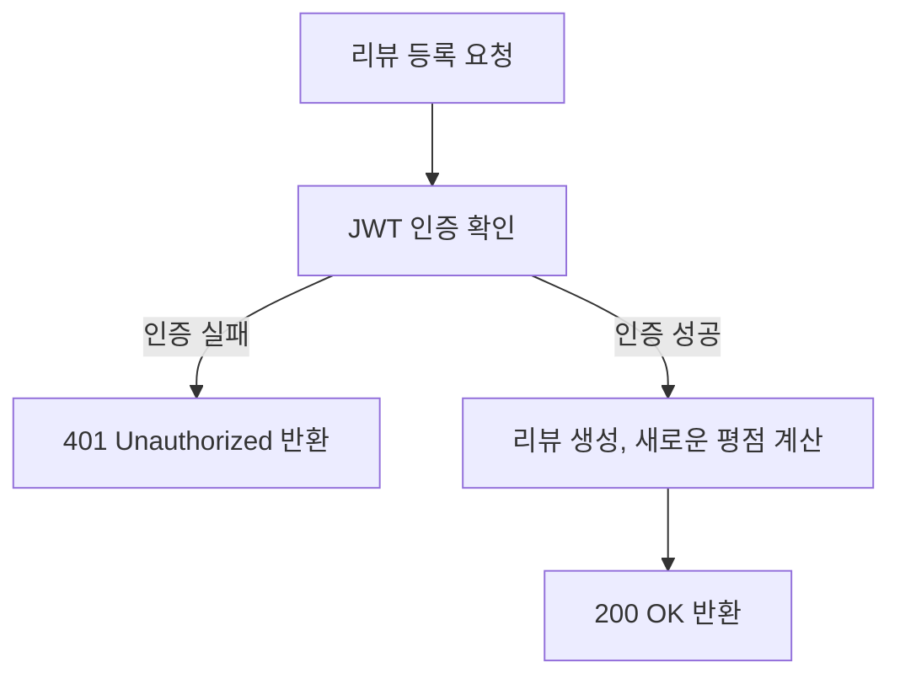

### **마일스톤 (Milestones)**

> ~8월 28일 : 리뷰 엔티티 정의 <br>
~8월 29일: 기능 구현
>
</details>

<details>
	<summary> 시군구 목록 API </summary>

### **요약 (Summary)**

사용자는 도/광역시에 속한 시/군/구 목록을 조회할 수 있습니다.

### **목표 (Goals)**

- `도/광역시`에 속한 `시/군/구` 목록을 조회하는 API를 구현합니다.
- 효율적인 조회를 위해 시군구 데이터를 캐싱하여 성능을 최적화합니다.

### 요구사항 상세

- **설명**
    - 사용자는 도/광역시의 시/군/구 목록을 조회할 수 있습니다.

- **출력 데이터**
    - `도/광역시(province_name)`
    - `시/군/구 목록`
    - 각 시/군/구의 `위도(latitude)`, `경도(longitude)`

- **처리 과정**:
    1. 도/광역시로 그룹화한 시/군/구 목록을 조회합니다.
    2. 시/군/구 목록을 반환할 때, 시군구의 좌표 정보도 함께 포함됩니다.

- **예외 사항**
    - 시군구 데이터가 없을 시 빈 리스트를 반환합니다.

### **계획 (Plan)**

### Flowchart

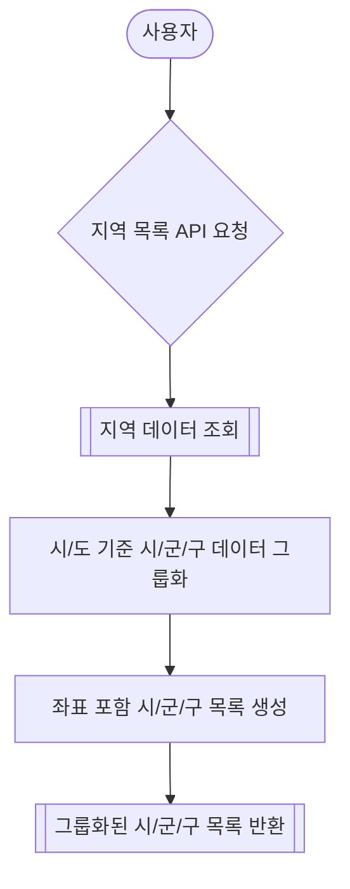

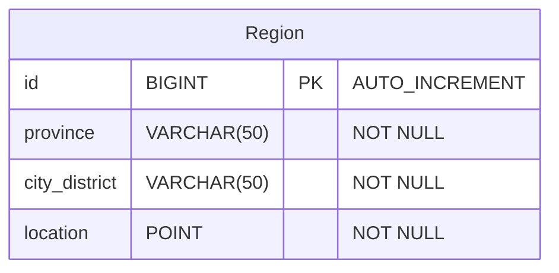

- DTO, 서비스, 레파지토리 구현
    - 도/광역시 및 시/군/구 데이터를 처리하고 검색하는 로직 작성

- 시군구 조회 컨트롤러 구현

- 테스트 코드 작성 및 기능 테스트
    - 시군구 조회 API
    - 통합 테스트

- 조회된 시군구 데이터를 캐싱하여 성능 최적화

### **이외 고려 사항들 (Other Considerations)**

- 캐시 만료: 시군구 데이터는 잘 변경되지 않으므로 캐시 만료 시간을 길게 설정?
- API 성능 테스트: 캐싱 전후의 성능 차이 테스트하고 최적화

### **마일스톤 (Milestones)**

- **8월 28일~8월 29일**: 엔티티 정의 및 시군구 조회 기능 설계
- **8월 30일**: 시군구 서비스 및 리포지토리 구현
- **8월 31일 ~ 9월 1일**: API 개발 및 시군구 관련 기능 구현
- **9월 2일**: 문서화 및 최종 점검
- **이후**: 캐싱 기능 구현 및 성능 최적화

</details>

<details>
		<summary> 맛집 목록(추천) API </summary>

### **요약 (Summary)**

사용자는 자신의 현재 위치 또는 선택한 특정 지역의 중심 좌표를 기준으로 일정 범위 내의 맛집 목록을 조회할 수 있습니다. 조회된 맛집 목록은 사용자의 요청에 따라 거리순 또는 평점순으로 정렬됩니다.

### **목표 (Goals)**

- `위도(Lat)`, `경도(Lon)`, `범위(Range)`를 기반으로 맛집 목록을 조회할 수 있습니다.
- 맛집 목록은 `거리순` 또는 `평점순`으로 정렬됩니다.
- 사용자는 "내 주변 보기" 또는 "특정 지역 보기" 기능을 사용하여 맛집 목록을 조회할 수 있습니다.

### **목표가 아닌 것 (Non-Goals)**

- 상세한 필터링 기능 (특정 음식 종류, 가격대 등)

### 요구사항 상세

- **설명**
    - 사용자는 현재 위치의 좌표를 기준으로 또는 선택한 특정 지역의 좌표를 기준으로 범위 내의 맛집 목록을 조회할 수 있습니다.
    - 맛집 목록은 사용자가 요청한 정렬 방식에 따라 거리순 또는 평점순으로 정렬합니다.

- **입력 데이터**
    - `위도(Lat)`
    - `경도(Lon)`
    - `범위(Range)` (단위: km)
    - `정렬방식(Sort)` - "거리순" 또는 "평점순"

- **출력 데이터**
    - `맛집 목록` - 이름, 종목, 위도/경도, 평점 등

- **처리 과정**
    1. 파라미터 위도(Lat), 경도(Lon), 범위(Range)를 기반으로 맛집 목록을 필터링
    2. 필터링된 맛집 목록을 사용자가 요청한 정렬 방식(거리순 또는 평점순)에 따라 정렬
    3. 정렬된 맛집 목록을 사용자에게 반환

- **예외 사항**
    - 위도/경도 또는 범위 값이 유효하지 않은 경우, 오류 메시지와 함께 조회 실패 응답을 반환
    - 정렬 방식이 "거리순" 또는 "평점순" 이외일 경우, 디폴트를 거리순으로 처리

### **계획 (Plan)**

### Flowchart

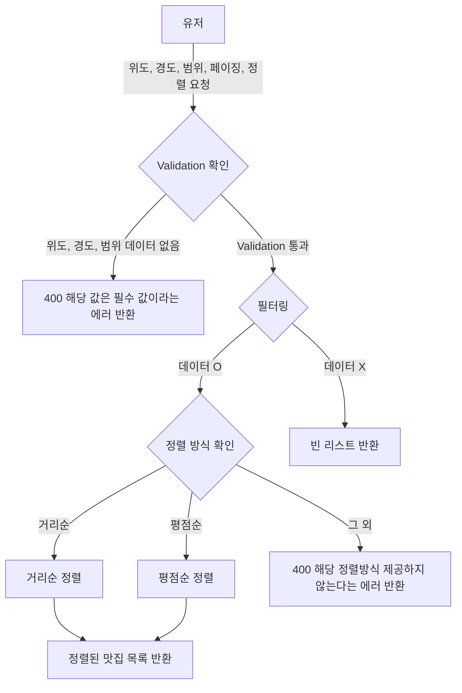

- DTO, 서비스, 레파지토리 구현
    - 위도/경도 및 범위를 사용한 맛집 필터링 로직 작성
    - 거리 계산 및 거리순, 평점순 정렬 로직 구현 (Hibernate Spatial 함수를 이용)

- 맛집 조회 컨트롤러 구현

- 테스트 코드 작성 및 기능 테스트
    - 거리 계산, 정렬 로직, 맛집 목록 API 유닛 테스트
    - 통합 테스트

### **이외 고려 사항들 (Other Considerations)**

- 엔드포인트 정의 (경로와 HTTP 메서드)
    - GET /api/restaurants
        - `lat`, `lon`, `range`, `sort`, `page`
        - sort - distance/rating

- 거리계산 방식 - MYSQL Point 타입 사용, Hibernate Spatial 함수 활용해서 쿼리 간소화
- "내 주변 맛집 보기", "특정 지역 주변 맛집 보기" 모두 중심 좌표를 파라미터로 하는 하나의 api로 처리

### **마일스톤 (Milestones)**

- **8월 29일**: ERD 확정 및 엔티티 구현
- **8월 30일 ~ 9월 2일**: 맛집 서비스 및 레파지토리, 컨트롤러 구현
- **9월 2일 ~ 9월 3일**: 테스트, 문서화 및 최종 점검

</details>

<details> 
<summary>사용자 설정 업데이트 API</summary>
    
### **요약 (Summary)**
    
사용자의 위치 정보와 점심 추천 기능 설정을 업데이트하는 역할을 합니다.
    
### **목표 (Goals)**
    
사용자 위치 정보 업데이트
        
- 사용자의 위치 정보를 데이터베이스에 저장하여 위치 기반 맛집 추천 서비스의 정확성을 유지합니다.
        
점심 추천 기능 설정
        
- 사용자가 점심 추천 기능의 활성화 여부를 선택할 수 있도록 하여, 맞춤형 알림 서비스를 제공합니다.
        
데이터 유효성 검증
        
- 사용자가 입력한 위치 정보와 점심 추천 기능 설정의 유효성을 검증하여, 잘못된 입력이 서비스에 영향을 미치지 않도록 합니다.
        
보안 및 인증
        
- JWT를 사용하여 사용자 인증 및 권한을 검증하며, 인증된 사용자만이 자신의 설정을 업데이트, 조회할 수 있도록 합니다.
        
    
### **목표가 아닌 것 (Non-Goals)**
    
- 사용자 프로필 관리
        
- 사용자 계정, 비밀번호 등 프로필 정보를 업데이트하는 기능이 아닙니다.
        
    
### **계획 (Plan)**
    
데이터베이스 인터페이스 구현
        
- `MemberRepository`를 통해 사용자 정보를 조회할 수 있도록 구현합니다.
        
API 설계 및 구현
        
- JWT 인증 로직을 통해 요청자의 신원을 확인합니다.
- 위치 정보와 점심 추천 기능 설정 값을 검증하는 로직을 구현합니다.
- 검증된 데이터를 기반으로 사용자의 설정을 업데이트하는 로직 작성합니다.
    
    
<details> 
<summary>플로우 차트</summary>
    
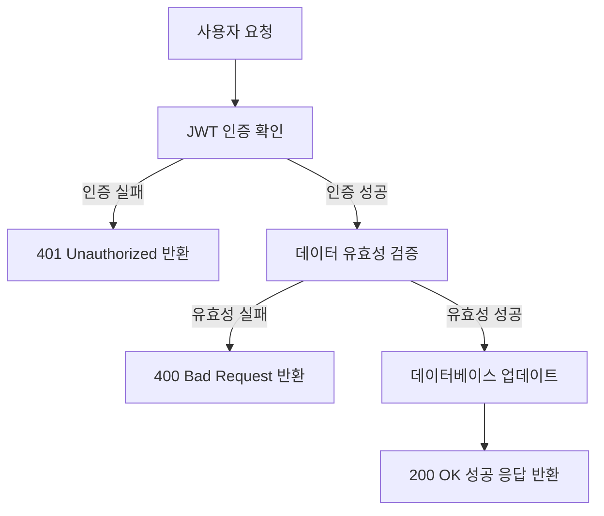
</details>
    
<details> 
<summary>클래스 다이어그램</summary>
    
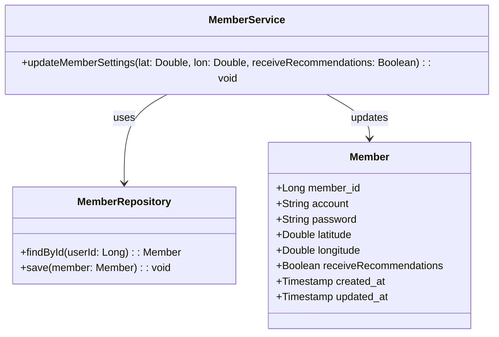
</details>
    
<details> 
<summary>시퀀스 다이어그램</summary>
    
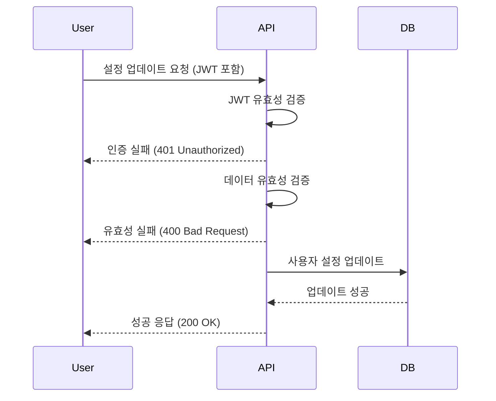
</details>
    
<details> 
<summary>API 설계</summary>
    
**Endpoint:** `PATCH /api/member/settings`
    
**요청 헤더:** `Authorization: bearer {JWT_TOKEN}`
    
**Request Body:**
    
```json
    {
      "lat": 37.5665,
      "lon": 126.9780,
      "receiveRecommendations": true
    }
```
    
**Response:**
    
- **200 OK:** 성공적으로 업데이트된 경우.
        
```json
        {
          "message": "요청이 성공했습니다."
        }
```
        
- **400 Bad Request:** 위도, 경도의 범위가 잘못된 경우
        
```json
        {
          "error": "위도 또는 경도의 범위가 잘못되었습니다."
        }
```
        
- **400 Bad Request:** 위도 혹은 경도 값이 누락된 경우
        
```json
        {
          "error": "위도와 경도는 모두 제공되어야 합니다."
        }
```
        
- **401 Unauthorized:** 인증되지 않은 사용자가 접근한 경우.
        
```json
        {
          "error": "인증 오류가 발생했습니다."
        }
```
</details>
    
### **이외 고려 사항들 (Other Considerations)**
    
- 보안: JWT의 유효성 및 보안을 검토하며, 인증되지 않은 사용자의 접근을 방지합니다.
- 에러 처리: 발생 가능한 에러 케이스에 대한 에러 메시지를 적절하게 반환할 수 있도록 합니다.
    
### **마일스톤 (Milestones)**
    
> ~ `8월 28일`: 요구사항 분석 <br>
~ `8월 29일`: API 설계 및기본 구현 완료 <br>
~ `8월 30일`: 테스트, 문서화
>
</details>


<details>
<summary>사용자 정보 API</summary>
    
### **요약 (Summary)**
    
사용자의 정보를 조회하여 계정, 위치 정보, 점심 추천 기능 활성화 여부를 확인할 수 있습니다.
    
### **목표 (Goals)**
    
- `패스워드` 를 제외한 모든 사용자 정보를 반환합니다.
- 클라이언트에서 사용자 위, 경도 / 점심추천 기능 사용여부 를 사용하기 위해서 입니다.
    
### **계획 (Plan)**
    
데이터베이스 인터페이스 구현     
- `MemberRepository`를 통해 사용자 정보를 조회할 수 있도록 구현합니다.
        
API 설계 및 구현      
- JWT 인증 로직을 통해 요청자의 신원을 확인하고, 해당 사용자의 정보를 조회하여 반환합니다.
    

<details>
<summary>플로우 차트 </summary>
	
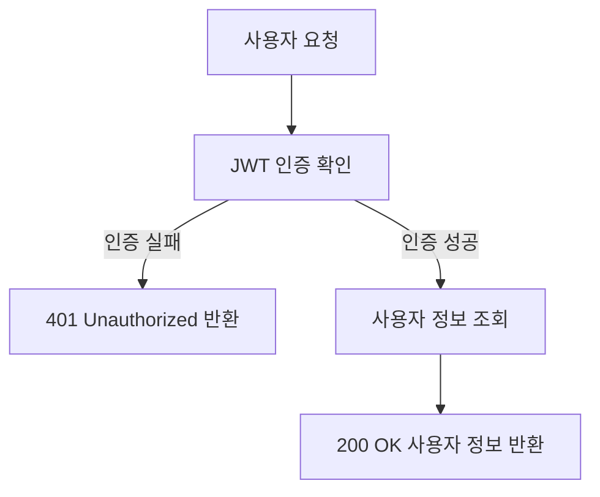
</details>

    

<details>
<summary>클래스 다이어그램</summary>
    
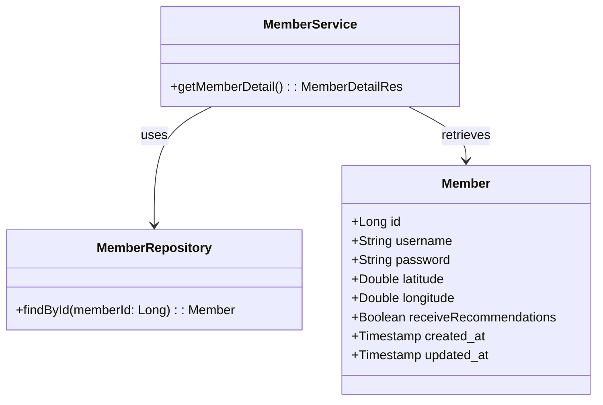
</details>

    

<details>
<summary>시퀀스 다이어그램</summary>
    
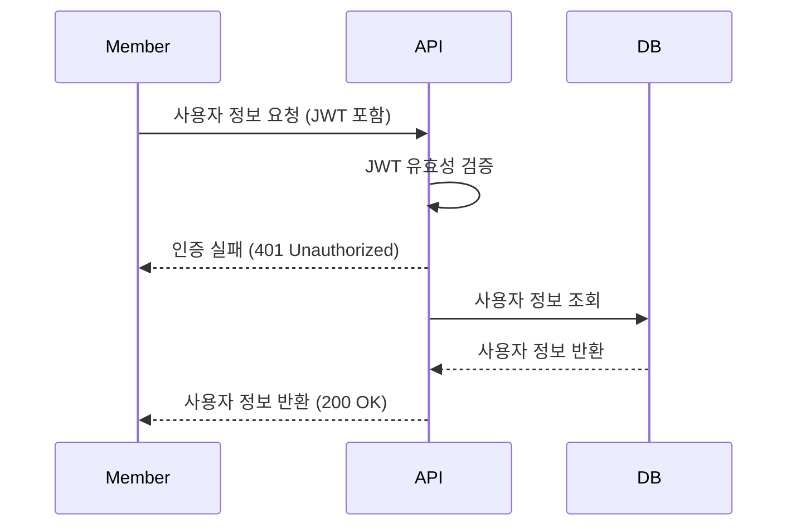
</details>

    

<details>
<summary>API 설계</summary>
    
**Endpoint:** `GET /api/member`
    
**요청 헤더:** `Authorization: bearer {JWT_TOKEN}`
    
**Response:**
    
- **200 OK:** 성공적으로 업데이트된 경우.
        
```json
        {
        	"memberId": 123,
        	"account": "abc",
          "latitude": 37.5665,
          "longitude": 126.9780,
          "receiveRecommendations": true
        }
```
        
- **401 Unauthorized:** 인증되지 않은 사용자가 접근한 경우.
        
```json
        {
          "error": "인증 오류가 발생했습니다."
        }
```
</details>

        
    
### **마일스톤 (Milestones)**
    
> ~ 8월 28일: 요구사항 분석 <br>
~ 8월 29일: 기본 구현 완료 <br>
~ 8월 30일: 테스트 및 문서화
>
</details>


<details>
		<summary> 맛집 상세 정보 API </summary>

### **요약 (Summary)**

맛집 id를 받아서 맛집 상세 정보를 반환합니다.

### **목표 (Goals)**

- 맛집 고유 `id` 를 받아서 해당 맛집 상세정보를 반환합니다.
- 맛집의 `평가 항목`도 함께 반환합니다.
- `평가 항목` 에는 `총점, 리뷰 개수, 총점 평균`이 포함됩니다.
- 만약 조회하려는 맛집 정보가 `캐시`에 있으면 `캐시`에서 반환합니다.

### **계획 (Plan)**

#### API 응답 형식

  ```json
  [
  {
    "data": {
      "id": 1,
      "name": "밥집",
      "businessType": "KOREAN_FOOD",
      "phoneNumber": "010-1234-5678",
      "location": {
        "x": 1,
        "y": 1
      },
      "oldAddressFull": "용산구 청파동",
      "roadAddressFull": "용산구 이태원동",
      "reviewRating": {
        "totalReviews": 10,
        "totalScore": 30,
        "averageScore": 3.0
      }
    }
  }
]
  ```

#### 플로우 차트

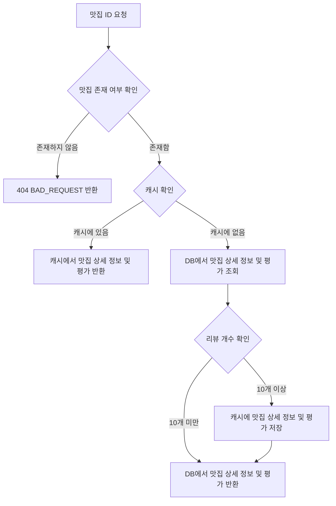

### **이외 고려 사항들 (Other Considerations)**

- 캐싱 조건
    - `리뷰가 10개 이상` 달린 맛집만 캐시에 저장합니다.

### **마일스톤 (Milestones)**

> ~8월 28일(수) : 요구 사항 분석
>
> ~8월 29일(목) : 맛집 상세 정보 반환 `dto` 생성, `더미 데이터` 생성
>
> ~8월 30일(금) : `controller. service` 로직 작성
>
> ~9월 3일(화) : `redis` 를 사용한 고도화 작업, `README` 작성, Rollout
>

</details>
<details> 
<summary>데이터 파이프라인</summary>

# **요약 (Summary)**

맛집 데이터를 수집하기 위한 데이터 파이프라인을 작성합니다.

API 호출로 동작되는 기능이 아닌 스케쥴러를 통해 매 시간 실행되는 기능들입니다.

# **목표 (Goals)**

- 서울시 일반음식점 인허가 정보 OpenAPI를 통해 데이터를 수집합니다.
- 데이터를 내부에서 사용될 형태로 변경합니다.
- 누락되거나 이상값을 가질 경우 처리방침을 정하고 구현합니다.
- 어떻게던 **하나의 상호가 중복 생성되지 않아야 합니다.**
- 스케쥴러를 설정하여 데이터 파이프라인 로직을 지정한 시간마다 실행시킵니다.

# **계획 (Plan)**
#### 작업 순서 정리
1. 데이터 분석 및 전처리 사항 정리
2. Spring batch 패키지 구조 설계
3. Step 01. API 응답 받아 row_seoul_restaurant 에 저장
4. Step 02. row_seoul_restaurant에 저장된 데이터 실제 운영 테이블인 restaurant 에 저장
5. 스케줄러 작업 처리


#### Step 1. 로우데이터 저장 로직
    
    1️⃣ Open API로 데이터를 요청
    
    - 한번의 요청으로 최대 1,000개의 데이터를 받아올 수 있기 때문에 1,000개씩 데이터를 불러와 캐시합니다. (HTTP 요청 최소화)
    - HTTP 요청 중 에러가 발생하면 재시도 로직을 구현합니다. (네트워크 문제일 경우, 재시도 시 성공할 수 있기 때문)
    
    2️⃣ 응답 데이터의 해시값을 통해 기존 데이터에서 변경이 된 데이터만 필터링
    
    - 응답 데이터와 기존 데이터는 관리번호(unique)로 매핑합니다.
    - 변경된 데이터만 삽입/수정하여 효율성 ↑
    
    3️⃣ 로우 데이터 저장 (해시값을 다시 생성하지 않도록 해시값도 함께 저장)
#### Step 2. 로우데이터 전처리 로직
    1️⃣ 지번 주소, 도로명 주소 개별 유효성 검사
    
    2️⃣ 상호명과 주소 기반 restaurant 객체 있다면 불러오기
    
    3️⃣ 폐업인 경우 존재한다면 삭제/ 존재하지 않았다면 저장 X
    
    4️⃣ 업태구분 설정[한식, 중식, 양식, 일식, 카페, 술집, 기타, None]
    
    5️⃣ 시군구 주소에서 `do-si`, `sgg` contain 검사 및 매핑
    
    6️⃣ 위,경도: `null`인 경우, 시군구 주소에서 위,경도 가져오기
    
#### 플로우 차트
    
  ```mermaid
     graph TD
        A[새벽 2시 스케줄러 실행] --> B[SeoulDataPiplineJob 에서 정해진 Step 실행]
        B --> C[Step 1_1. RowSeoulDataApiReader]
        C --> H{서울시 맛집 API 요청}
        H --> |응답 성공| D[Step 1_2. RowSeoulDataProcessor]
        H --> |응답 실패| I[RestClientException 에러 반환]
        D -->|해시값 비교 기반 변경 발생 객체 넘기기| E[Step 1_3. RowSeoulDataWriter]
        E -->|변경한 객체 row_seoul_restaurant 에 저장| F[Step 2_1. RowSeoulDataDBReader]
        F -->|row_seoul_restaurant 에서 데이터 읽어서 넘기기| G[Step 2_2. SeoulDataProcessor]
        G --> J{전처리 진행}
        J--> |전처리 성공| K[Step_2_3. SeoulDataWriter]
        J--> |전처리 실패| L[에러 로그 찍고 해당 객체 처리 X]
        K-->|전처리된 객체 restaurant에 저장| M[Job 실행 완료]
        
```
#### 시퀀스 다이어그램
    
 ```mermaid
    sequenceDiagram
        participant Schedular
        participant SeoulDataPiplineJob
        participant Step 01
        participant 서울시 맛집 api
        participant row Table
        participant Step 02
        participant system Table
    
        Schedular->>SeoulDataPiplineJob: 매일 새벽 2시마다 job 실행 요청
        SeoulDataPiplineJob->>Step 01: 실행 요청
        Step 01->>서울시 맛집 api: 호출 요청
        서울시 맛집 api->>Step 01: 응답 반환
        Step 01->> row Table: hash 비교 후, 업데이트된 데이터 저장
        Step 02->> row Table: 오늘 업데이트된 데이터 요청
        row Table->> Step 02: 요청한 데이터 반환
        Step 02->> system Table: 전처리된 데이터 저장
        
          
```

### 고민했던 점

  
<details> 
<summary>🌐 데이터 호출 작업 시 사용할 외부 API 요청 방법</summary>
    
    Spring에서 HTTP 엔드포인트에 대한 호출을 위해 총 4가지의 선택지를 제공합니다.
    
    **(1) Spring Cloud OpenFeign**
    
    Spring MVC 애너테이션을 통해 동적으로 구현체를 만들어 줍니다. 사용이 쉽지만, 커스텀이 어렵고 공식적으로 업데이트가 중단되었습니다. (cf. [공식문서](https://spring.io/projects/spring-cloud-openfeign))
    
    **(2) RestTemplate** 
    
    템플릿 메서드 API를 제공한는 동기 클라이언트입니다. 스프링에서는 공식적으로 RestTemplate보다 RestClient, WebClient 사용을 권장하고 있습니다. (cf. [공식문서](https://docs.spring.io/spring-framework/reference/integration/rest-clients.html#rest-resttemplate))
    
    **(3) RestClient**
    
    최신 HTTP 요청 API를 제공하는 동기 클라이언트입니다. (cf. [공식문서](https://docs.spring.io/spring-framework/reference/integration/rest-clients.html#rest-restclient))
    
    **(4) WebClient**
    
    비동기, 반응형 HTTP 요청을 제공하는 클라이언트 입니다. 동기 방식도 지원합니다. (cf. [공식문서](https://docs.spring.io/spring-framework/reference/integration/rest-clients.html#rest-webclient))
    
    위의 특징들을 고려해 봤을 때, Spring에서 권장하는 **RestClient**와 **WebClient**를 고민하였습니다. WebClient의 경우 Spring WebFlux에 대한 의존이 필요하고, 비동기 사용을 위해서는 러닝커브가 높기 때문에, RestClient를 도입하였고 추후 비동기 처리를 고려하기로 결정했습니다.
</details> 
<details> 
<summary>⏰ 스케줄러 라이브러리 중 Spring boot Scheduling 사용 이유</summary>
    
    Spring에서 스케줄링을 위해 총 3가지의 선택지를 제공합니다.
    
    **(1) Quartz Scheduler**
    
    오픈 소스의 고급 스케줄링 라이브러리로, Java 기반의 복잡한 스케줄링 작업을 지원합니다. 트리거, 잡, 작업 스케줄링 관리 기능을 강력하게 제공합니다.
    
    **(2)  Spring TaskScheduler**
    Spring Core의 `TaskExecutor`를 기반으로 한 기본적인 스케줄링 기능을 제공합니다. 주로 간단한 스케줄링 작업에 사용됩니다. 설정이 매우 쉽고 빠르게 적용이 가능하며 다양한 스케줄링 옵션이 있습니다.
    
    **(3) Spring Boot Scheduling**
    `Spring TaskScheduler`의 확장된 버전으로, 간단하게 스케줄링 작업을 설정할 수 있는 Spring Boot 내장 스케줄링 기능입니다. 러닝 커브가 짧고, 스프링과 완벽한 통합을 이루고 있습니다.
    
    복잡한 트리거 규칙이나 분산 시스템이 아니기에 러닝커브가 있는 Quartz 보다 간편하게 사용할 수 있는 Spring TaskScheduler와 Spring Scheduling 중에서 보다 간편한 사용이 가능하도록 확장된 버전인 Spring Scheduling으로 선택하게 되었습니다.
</details>  
<details> 
<summary>⏰ 스케줄러 시간대 설정 이유</summary>
    
    데이터 분석을 통해 `서울시 일반음식점 인허가 정보 API` 의 업데이트가 주로 23:59 에 이루어진다는 것을 파악하였습니다. 이에 해당 서버에서 데이터 업데이트가 맞게 이루어진 뒤, 트래픽이 조금 덜 몰릴 새벽 시간대에 작업을 진행하는 것으로 설정하였습니다.
</details>


# **마일스톤 (Milestones)**

> `~ 8/28(수)` : 데이터 분석 및 전처리 방식 논의
> 
> `~ 8/30(금)`: 스프링 배치 스터디
> 
> `~ 9/3(화)`: 기능 구현 완료
> 
> `~ 9/6(금)`: 리드미 작성 및 Rollout
> 
</details>

## Skills

언어 및 프레임워크: `Java 17`, `Spring Boot 3.x.x`

데이터베이스: `MySQL`

배포: `AWS EC2`, `Github Actions`, `Docker`

ETC: `Swagger`, `Lombok`, `Junit`

협업툴: `GitHub`, `Discord`, `Notion`

## ERD


## API 명세서

http://15.165.229.23:8080/swagger-ui/index.html

## 프로젝트 진행 및 이슈 관리

- 각 기능별 이슈 작성 후 하위 이슈 추가


## 회고
<details> 
<summary>조혜온</summary>
  - 공공데이터를 활용한 프로젝트라서 신기했습니다. 팀원분들과의 리뷰가 유익한 시간이였습니다. 짧은 기간이였지만 팀워크가 좋아서 무리없이 진행될 수 있었던 것 같습니다.     

</details>  


## Authors

<table>
    <tr align="center">
        <td><B>주다애<B></td>
        <td><B>강경원<B></td>
        <td><B>이도은<B></td>
        <td><B>정의진<B></td>
        <td><B>조혜온<B></td>
        <td><B>이예림<B></td>
    </tr>
    <tr align="center">
            <td>
            
            <br>
            <a href="https://github.com/jooda00"><I>jooda00</I></a>
        </td>
            <td>
            
            <br>
            <a href="https://github.com/toughCircle"><I>toughCircle<I></a>
        </td>
        <td>
            
            <br>
            <a href="https://github.com/medoeun"><I>medoeun</I></a>
        </td>
        <td>
            
            <br>
            <a href="https://github.com/uijin-j"><I>uijin-j</I></a>
        </td>
        <td>
          
            <br>
            <a href="https://github.com/hye-on"><I>hye-on</I></a>
        </td>
        <td>
          
            <br>
            <a href="https://github.com/yerim123456"><I>yerim123456</I></a>
        </td>
    </tr>

</table>
