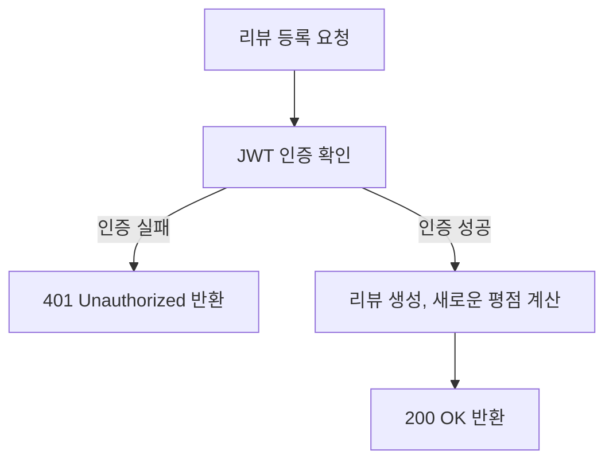

# yamyam-map

## **Table of Contents**

- [개요](#개요)
- [테크스펙](#테크스펙)
- [Skills](#skills)
- [ERD](#erd)
- [API 명세서](#api-명세서)
- [프로젝트 진행 및 이슈 관리](#프로젝트-진행-및-이슈-관리)
- [Authors](#authors)

## 개요

“얌얍맵”은 사용자가 주변 최고의 맛집을 찾을 수 있도록 돕는 것을 목표로 하는 위치 기반 맛집 추천 서비스입니다.  
[서울시 일반음식점 인허가 정보](https://data.seoul.go.kr/dataList/OA-16094/S/1/datasetView.do) 데이터를 활용하여, 지역 음식점 목록을 자동으로 업데이트하고 활용합니다. 

## 테크스펙

	
 리뷰 API 

  
  ### **요약 (Summary)**

맛집에 대한 리뷰를 합니다.

### **목표 (Goals)**

1~5 점 사이의 점수와 리뷰를 달 수 있습니다.

### **목표가 아닌 것 (Non-Goals)**

사진을 올릴 수 있습니다.

### **계획 (Plan)**

### **마일스톤 (Milestones)**

> ~8월 28일 : 리뷰 엔티티 정의  
~8월 29일: 기능 구현
>

## Skills

언어 및 프레임워크: `Java 17`, `Spring Boot 3.x.x`

데이터베이스: `Postgresql 16`

배포: `AWS EC2`, `Github Actions`

ETC: `QueryDsl`, `Swagger`, `Lombok`, `Junit`

협업툴: `GitHub`, `Discord`, `Notion`

## ERD

## API 명세서

http://15.165.229.23:8080/swagger-ui/index.html

## 프로젝트 진행 및 이슈 관리

- 각 기능별 이슈 작성 후 하위 이슈 추가

## Authors
<table>
    <tr align="center">
        <td><B>주다애<B></td>
        <td><B>강경원<B></td>
        <td><B>이도은<B></td>
        <td><B>정의진<B></td>
        <td><B>조혜온<B></td>
        <td><B>이예림<B></td>
    </tr>
    <tr align="center">
            <td>
            
             
            <a href="https://github.com/jooda00"><I>jooda00</I></a>
        </td>
            <td>
            
             
            <a href="https://github.com/toughCircle"><I>toughCircle<I></a>
        </td>
        <td>
            
             
            <a href="https://github.com/medoeun"><I>medoeun</I></a>
        </td>
        <td>
            
             
            <a href="https://github.com/uijin-j"><I>uijin-j</I></a>
        </td>
        <td>
          
             
            <a href="https://github.com/hye-on"><I>hye-on</I></a>
        </td>
        <td>
          
             
            <a href="https://github.com/yerim123456"><I>yerim123456</I></a>
        </td>
    </tr>

</table>
